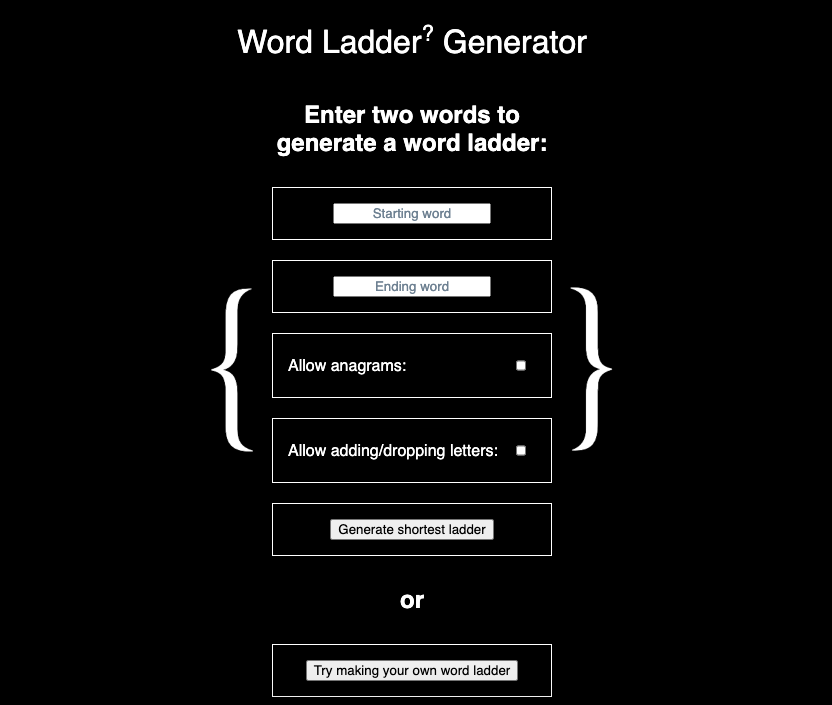
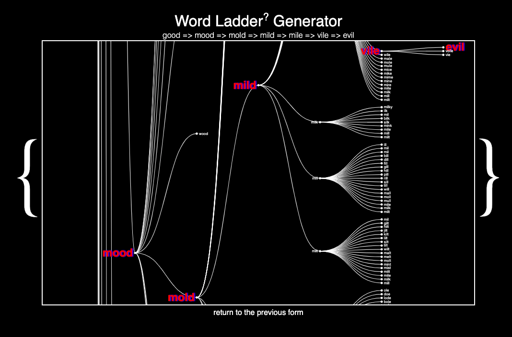

<h1> Word Ladder Generator </h1>

<a href="https://mxcrpntr.github.io/JSProject/">Word Ladder Generator</a> is an interactive data visualization project utilizing a dictionary wordlist text file and some tree traversal algorithms to construct <a href="https://en.wikipedia.org/wiki/Word_ladder">word ladders</a> and generate (often massive) radial tree visualizations of the word ladder search trees using JavaScript and d3.

 

 

I was inspired to write this program to explore the extensiveness of connection between words using simple operations, and, for the purpose of making the dictionary <i>even more connected</i>, I opted to include non-traditional word ladder operations (<i>i.e.</i>, anagramming and adding or dropping one letter) as options for users. As I worked more on the code behind the ladder- and tree-generating algorithms I became further motivated by the pursuit of the greatest possible efficiency in my ladder creation and tree searching code. (See the anagram finder snippet below.)

 

<h2>Functionality and MVPs</h2>

Users are currently able to:

<ul>
<li>enter two words and, if both words are valid dictionary entries, see the shortest corresponding ladder between the two words as well as the tree visualization generated while searching for the word ladder;</li>
<li>explore the various other 'sub-ladders' in the tree visualization;</li>
<li>enter their own word ladder and see what the program thinks of it. (Can it find one that is shorter, or is the user's as good as it gets?)</li>
</ul>

 

<h2>Implementation Timeline</h2>

<ul>
<li><b>Thursday, June 29, 2023</b>: I wrote skeletal, but working, JavaScript code for the WordNode nodes and WordLadder tree/ladder generators.</li>
<li><b>Friday, June 30, 2023</b>: I streamlined this code, focusing especially on changing the finding of anagrams in a dictionary from an <i>n</i>! operation to a (nearly) constant-time operation. This involved an initialization operation of turning the dictionary text file into a JavaScript Object whose keys are sorted arrays of letters and whose values are arrays of dictionary words whose letters sort to the key array:
 
<code>
const response = await fetch('./src/dictionary.txt');
const data = await response.text();
const dictionary = data.split("\n");
const dictionarySet = new Set(dictionary);
const dictionaryObj = {};
for (let i = 0; i < dictionary.length; i++) {
    let sorted = dictionary[i].split("").sort();
    let anaArray = dictionaryObj[sorted];
    if (anaArray != undefined) {
        anaArray.push(dictionary[i]);
        dictionaryObj[sorted] = anaArray;
    } else {
        dictionaryObj[sorted] = [dictionary[i]];
    }
}
</code>
 
I then was able to search for all anagrams of any dictionary word with a constant-time lookup in merely two lines of code:

<code>
let sorted = this.word.split("").sort();
let anagrams = this.dictionaryObj[sorted];
</code>

 </li>
<li><b>Saturday-Sunday, July 1-2, 2023</b>: I spent the weekend honing in on d3 tree visualizations, especially Observable's <a href="https://observablehq.com/@d3/tree">Tidy Tree</a>, and worked on styling them for web display.</li>
<li><b>Monday-Tuesday, July 3-4, 2023</b>: I spent Monday and Tuesday going down all sorts of d3 rabbitholes, trying out different tree visualization styles and animations before concluding that, for the purposes of showing word ladder search trees, which often number in the thousands of nodes, the aforementioned Tidy Tree model was optimal.</li>
<li><b>Wednesday, July 5, 2023</b>: Wednesday was spent working hard on CSS styling, which I left to the last two days of this project simply because the algorithms and d3 learning took up more time than I had anticipated. I attempted to go for a very minimalist and sleek view that reflected the general lo-fi nature of the program.</li>
<li><b>Thursday, July 6, 2023</b>: I continued styling and prepared the project for presentation to my App Academy cohort.</li>
<li><b>Beyond</b>: I look forward to extensively cleaning up the code as it is (both by making it more efficient and tidying it up) and add multiple options for exploring the trees created. I also look forward to the idea of introducing further word-modifying operations and assembling a far more extensive and helpful dictionary file (or multiple dictionary options for users).</li>
</ul>

